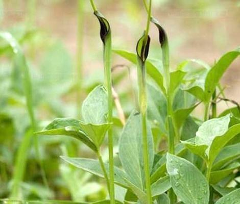
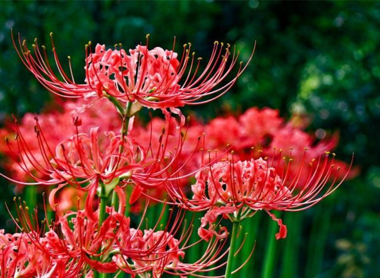
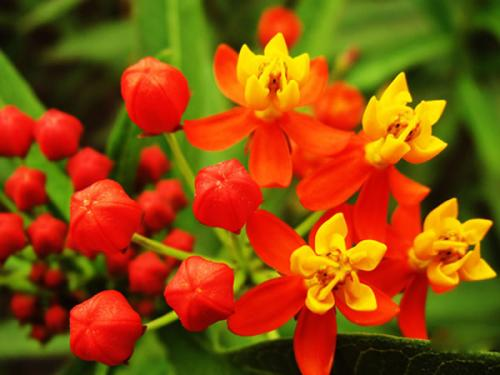

# 植物中化学成分的研究

## 天南星科

* [天南星科有毒中药刺激性作用比较研究](http://www.cqvip.com/QK/95973X/200804/26555123.html)
* [天南星科植物中粘膜刺激性成分的研究现状和分析](http://xueshu.baidu.com/usercenter/paper/show?paperid=50c9cb28255727f1d52c2c3e0622d7f6&site=xueshu_se)

## 石蒜科

* [石蒜科植物生物碱成分的药理学研究](http://xueshu.baidu.com/usercenter/paper/show?paperid=bc5967ec4a7915da8989870ff0df2a2b&site=xueshu_se)
* [石蒜科药用植物生物碱的药理学研究](http://xueshu.baidu.com/usercenter/paper/show?paperid=d47fc7ab675c578e9537997baca5e1ca&site=xueshu_se)

## 萝藦科

* [萝藦科植物的药理作用研究](http://xueshu.baidu.com/usercenter/paper/show?paperid=395dfbfeeb661a055fc988b7195e5c77&site=xueshu_se)
* [萝藦科马利筋族植物化学成分研究进展](http://xueshu.baidu.com/usercenter/paper/show?paperid=deb3af35952d33dac2bbbcfd806ba964&site=xueshu_se)

